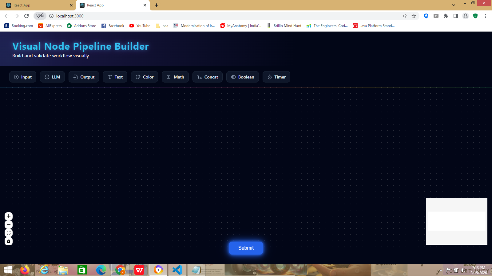
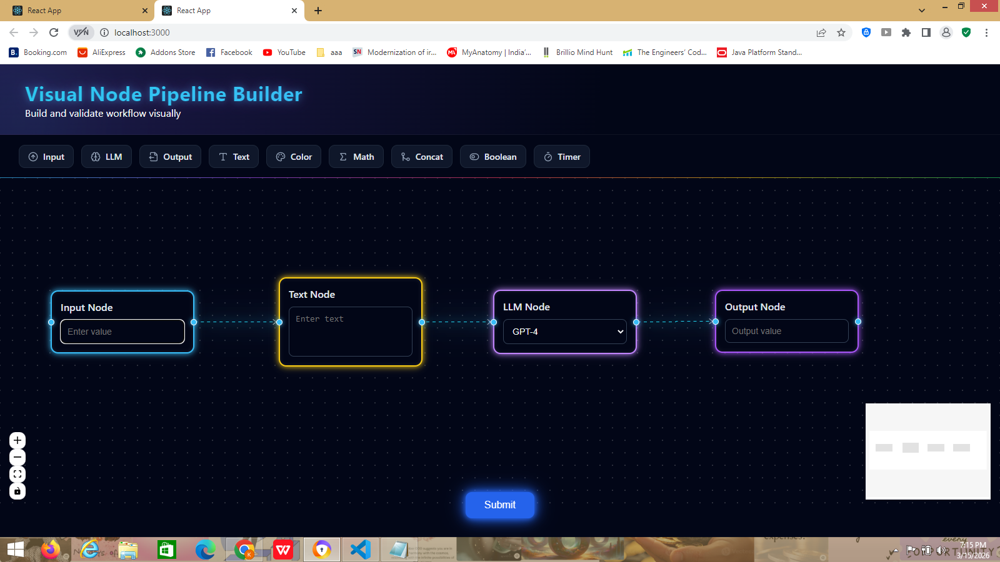
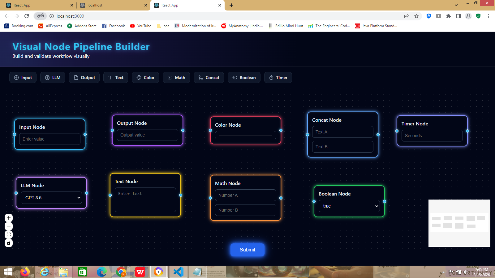
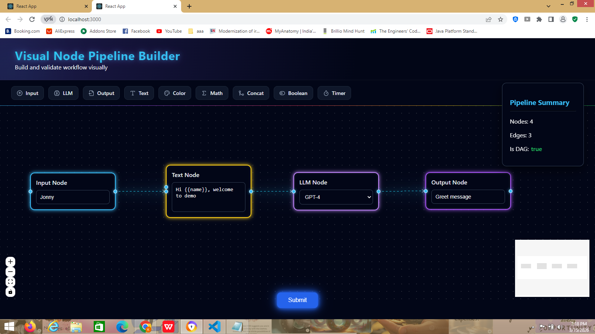

# Visual Node Pipeline Builder

A visual workflow builder built using **React + ReactFlow** that allows users to create and connect nodes to form a pipeline.

The application provides a **drag-and-drop interface** for building workflows and validating the structure of the pipeline.

This project was completed as part of the **VectorShift technical assessment**.

---

# Overview

The application allows users to visually create pipelines by dragging nodes onto the canvas and connecting them together.

Users can:

• Drag nodes from the toolbar  
• Connect nodes visually  
• Define dynamic variables inside text nodes  
• Automatically generate handles for variables  
• Build workflow pipelines  
• Validate pipelines and check if they form a **Directed Acyclic Graph (DAG)**  

After creating a pipeline, clicking **Submit Pipeline** displays a summary showing:

- Number of nodes
- Number of edges
- Whether the pipeline is a DAG

---

# Features

## Node Abstraction

To avoid duplicate code across nodes, a reusable **BaseNode component** was created.

All node types inherit from this component which manages:

- Layout
- Handles
- Styling
- Content rendering

This abstraction allows new nodes to be created quickly without rewriting common logic.

Example usage:

```javascript
<BaseNode title="Input Node" type="input-node">
  <input type="text" placeholder="Enter value" />
</BaseNode>
```

---

# Implemented Node Types

The system includes the following nodes:

Input Node  
Output Node  
Text Node  
LLM Node  
Math Node  
Boolean Node  
Concat Node  
Timer Node  
Color Node  

These nodes demonstrate the flexibility of the node abstraction.

---

# Text Node Logic (Dynamic Variables)

The **Text Node** allows users to define variables using double curly brackets.

Example:

```
Hello {{name}}, welcome to the workflow demo
```

When a variable is detected:

• A **new input handle** automatically appears on the left side of the Text Node  
• The handle can be connected to another node (such as an Input Node)

Example pipeline:

```
Input Node → Text Node → LLM Node → Output Node
```

---

# Styling

The UI was redesigned to provide a modern workflow builder experience.

Design features include:

• Dark themed interface  
• Neon glowing nodes  
• Animated pipeline edges  
• Color-coded node types  
• Interactive toolbar  
• Centered submit button  
• Pipeline summary panel  

Each node type has its own accent color:

Input Node – Blue  
LLM Node – Purple  
Text Node – Yellow  
Math Node – Orange  
Boolean Node – Green  
Concat Node – Light Blue  
Timer Node – Indigo  
Color Node – Red  

Edges are animated to simulate **data flowing through the pipeline**.

---

# Pipeline Validation

When the **Submit Pipeline** button is clicked, the application calculates:

- Number of nodes
- Number of edges
- Whether the pipeline forms a Directed Acyclic Graph

Example output:

```
Nodes: 3
Edges: 2
Is DAG: true
```

The result is displayed in a **Pipeline Summary panel** in the UI.

---

# Example Pipeline

Example pipeline created in the application:

```
Input Node      : John
Text Node       : Hello {{name}}
LLM Node        : GPT-4
Output Node     : greeting_message
```

Connections:

```
Input → Text → LLM → Output
```

After clicking Submit Pipeline:

```
Nodes: 4
Edges: 3
Is DAG: true
```

---

# Screenshots

## 1. Application Interface

Overview of the workflow builder interface with toolbar and canvas.



---

## 2. Creating a Pipeline

Example pipeline created by connecting nodes together.

Input → Text → LLM → Output



---

## 3. Dynamic Variable Handle

When a variable like `{{name}}` is typed in the Text Node, a new input handle automatically appears on the left side.


---

## 4. Available Node Types

Different node types created using the reusable BaseNode abstraction.



---

## 5. Pipeline Validation Summary

When the **Submit Pipeline** button is clicked, the application displays the number of nodes, edges, and whether the pipeline is a DAG.



---

# Project Structure

```
frontend/src

nodes/
  baseNode.js
  inputNode.js
  outputNode.js
  textNode.js
  llmNode.js
  mathNode.js
  booleanNode.js
  concatNode.js
  colorNode.js
  timerNode.js

App.js
toolbar.js
ui.js
draggableNode.js
store.js
submit.js
index.js
index.css
```

---

# Running the Project

## Install dependencies

Navigate to the frontend folder:

```
cd frontend
npm install
```

---

## Start the development server

```
npm start
```

The application will run at:

```
http://localhost:3000
```

---

# Backend Integration

The original assignment includes a **FastAPI backend** for parsing pipelines.

However, this implementation focuses on the **frontend pipeline builder and validation logic**.

Since the backend requires Python/FastAPI, the pipeline validation was implemented on the **frontend side** to demonstrate the same functionality.

---

# Technologies Used

React  
ReactFlow  
Zustand (state management)  
JavaScript  
CSS  

---

# Future Improvements

• Full FastAPI backend integration  
• Real pipeline execution engine  
• Variable value propagation across nodes  
• Pipeline saving/loading  
• Advanced DAG validation algorithms  
• Node configuration panels  

---

# Author

Vanashree  
Frontend Developer